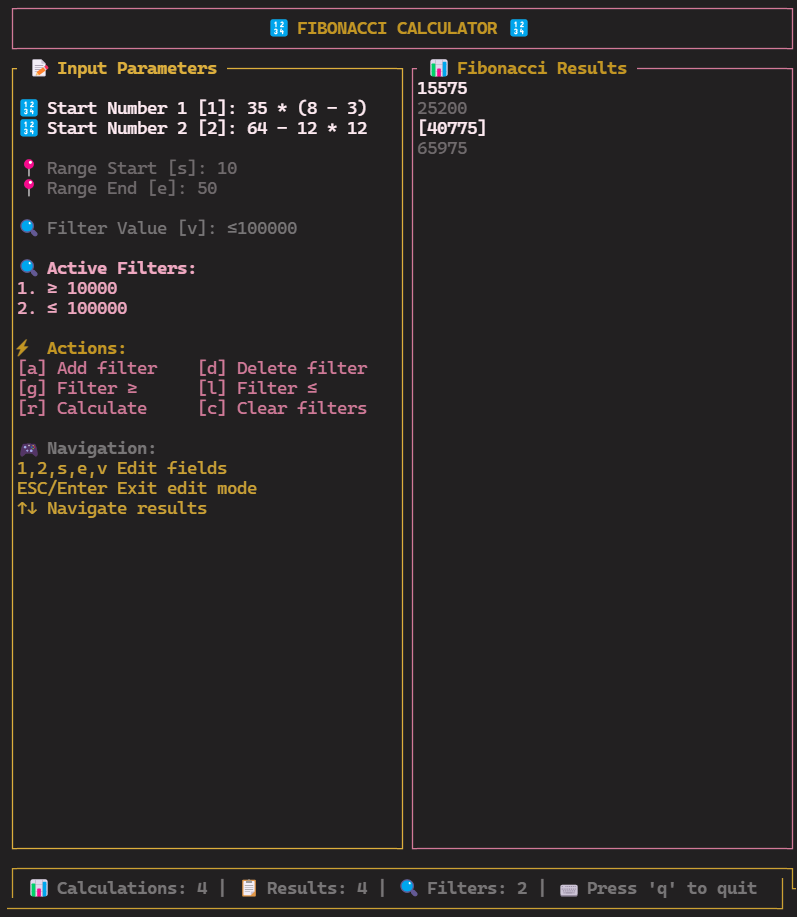

# Fibonacci View

Screen1 (Empty result):


Screen2 (Has not filters):


Screen3 (Has filters):



---

# Бенчмарки и профилирование

## Производительность (Criterion)

Для оценки производительности вычислений Фибоначчи ([fibo_calc](./crates/fibo_calc)) используется [Criterion.rs](https://bheisler.github.io/criterion.rs/book/index.html). Бенчмарк `bench_fibo_calc` измеряет скорость вычисления последовательности Фибоначчи на диапазоне чисел.

**Запуск бенчмарка:**
```sh
cargo bench -p fibo_calc
```

## Профилирование памяти (dhat)

Для анализа потребления памяти реализован отдельный бенчмарк с использованием [dhat](https://docs.rs/dhat/latest/dhat/). Скрипт `memory_profiling.rs` сохраняет подробный отчёт о распределении памяти во время вычислений.

**Запуск профилирования:**
```sh
# Для библиотеки
cargo bench -p memory_profiling_calc
# Для TUI
cargo bench -p memory_profiling_view
```

После выполнения отчёт будет сохранён в директории `target/profiling`. Его можно визуализировать с помощью [dhat-viewer](https://nnethercote.github.io/dh_view/dh_view.html).

---

# Coverage

Для оценки покрытия тестами используется [cargo-tarpaulin](https://github.com/xd009642/tarpaulin). Отчёт о покрытии генерируется в формате HTML в директории `target/coverage`.

**Запуск покрытия:**
```sh
cargo tarpaulin --exclude-files "examples/*" --output-dir "./target/coverage/" --ignore-tests --out Html
```

---

# Task

1) Matrix math Fibo Nums
2) CI/CD for realize
3) Add complex filters
4) Smart cache
5) Cntr+C for copy selected num and Cntr+Shift+C for copy all
6) More shortcuts 
7) tests

---
