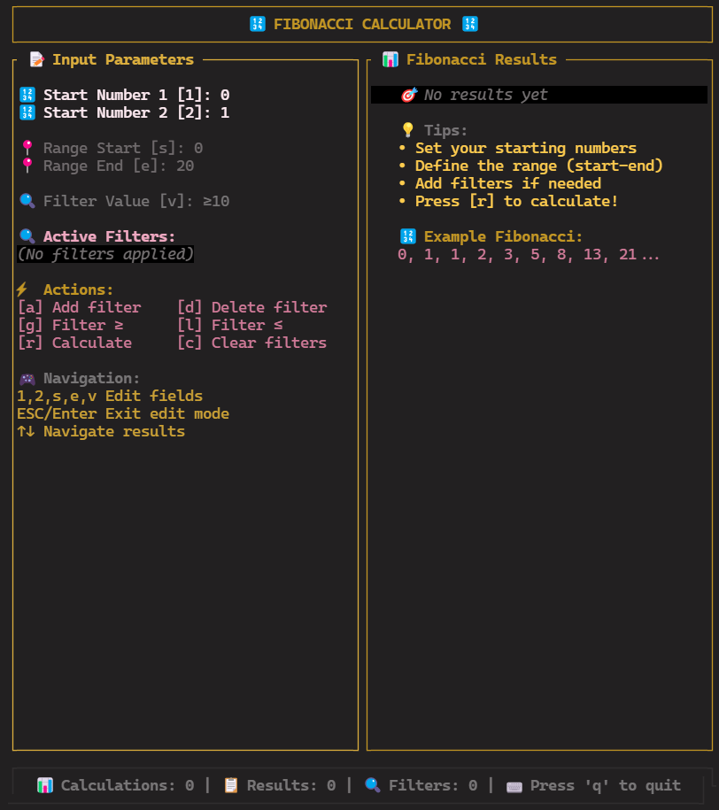

# Fibonacci View

Screen1 (Empty result):



Screen2 (Has not filters):


Screen3 (Has filters):


---

# Task

1) Scroll nums (smart: app view only nums which user look)
2) Matrix math Fibo Nums
3) CI/CD for realize 
4) Add complex filters 
5) Smart cache
6) Cntr+C for copy selected num
7) Coverage + tests

---

# Бенчмарки и профилирование

## Производительность (Criterion)

Для оценки производительности вычислений Фибоначчи ([fibo_calc](./crates/fibo_calc)) используется [Criterion.rs](https://bheisler.github.io/criterion.rs/book/index.html). Бенчмарк `bench_fibo_calc` измеряет скорость вычисления последовательности Фибоначчи на диапазоне чисел.

**Запуск бенчмарка:**
```sh
cargo bench -p fibo_calc
```

## Профилирование памяти (dhat)

Для анализа потребления памяти реализован отдельный бенчмарк с использованием [dhat](https://docs.rs/dhat/latest/dhat/). Скрипт `memory_profiling.rs` сохраняет подробный отчёт о распределении памяти во время вычислений.

**Запуск профилирования:**
```sh
# Для библиотеки
cargo bench -p memory_profiling_calc
# Для TUI
cargo bench -p memory_profiling_view
```

После выполнения отчёт будет сохранён в директории `target/profiling/dhat-heap.json`. Его можно визуализировать с помощью [dhat-viewer](https://nnethercote.github.io/dh_view/dh_view.html).

---
